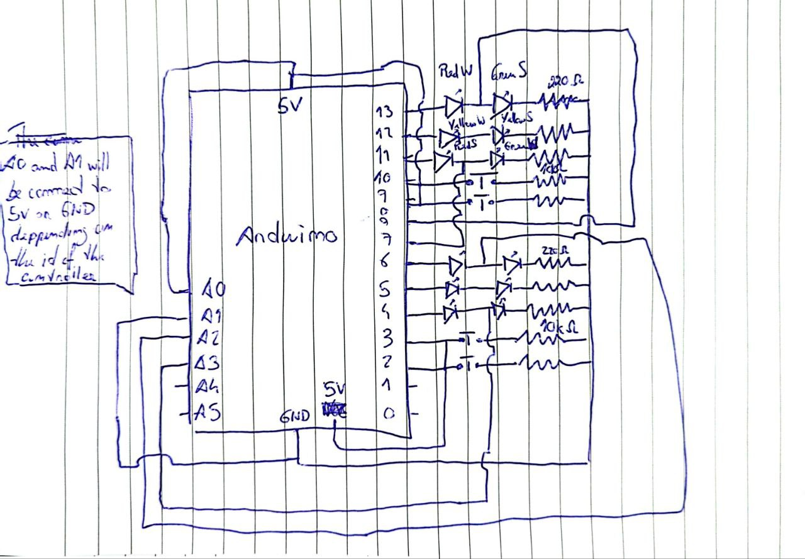
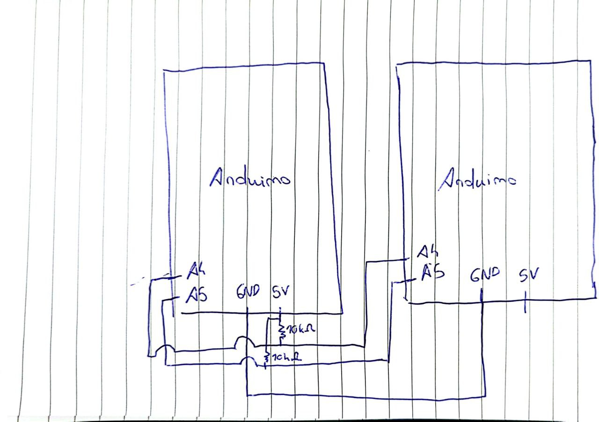

# ACIC - Lab 3 Report - Group 2

## Design of the circuits

The design of the circuit is represented in Figure 1. Each controller (Arduino UNO) controls 2 junctions. Each circuit consists in 2 x 3 LED (one red, one yellow, one green per junction) to emulate the traffic lights, 2 x 1 press button to emulate the ILD and the id of the controller is set in pins A0 and A1. Aditionally, to support I2C communication between nodes the controller uses the pins A4 and A5 and the circuit schematics to connect 2 controllers is represented in Figure 2.





## Overall architecture

Each junction is managed by the `Cruzamento` class. Each junction's internal state is completely independent. However, to support communication between junctions controlled by the same controller a reference to another `Cruzamento` is needed since I2C does not allow for communication intra-controller. The communication between junctions is event driven and each event changes the internal state of the `Cruzamento` object according to the specifications in the project description. The intended mode of operation is set by the first junction and replicated across controllers. All period values are hardcoded as well as the number of junctions in the network since the first junction needs to broadcast the intended mode of operation to other junction and the `SYNC ACK` signal to end the booting phase. 

The lifecycle of each junction consists in the booting phase and a main loop. In the booting phase a clock synchronization procedure takes place and a broadcast of the intended operation mode is made by the first junction. The main loop handles the polling of the ILDs (since the Arduino UNO only possesses 2 pins that are able to handle interrupts and each controller has 4 ILDs), the red LED malfunctioning checks, and the LED cycle (green, yellow, red, yellow).

## Safety and fault-tolerance measures

When a red light is malfunctioning the controller is able to detect it by reading the OUTPUT of the red LED. If the output does not match the INPUT state of the LED the system enters the malfunctioning state where the yellow lights blink with a 2 second period.

## "Intelligent" functions implemented

The first intelligent feature of the system is being able to track the amount of traffic in each street and change the duty cycle of the LEDs to match the traffic levels in the streets. This feature is present in mode 1 and 2.

Aditionally, in mode 2, the controllers communicate and can detect overspeeding by sending an event via I2C each time a car triggers the ILD to the junction ahead (east). This functionality supports up to 10 cars at the same time between junctions. This value depends on the available heap memory in the controller since the data structure needed consums a great amount of memory. This functionality is not only dependent of the west street since a controller also sends a signal every time a car triggers the south street's ILD to the junction ahead. This way it can detect speeding between junctions independently of the starting point of the car.

## Program code

lab3.ino

```cpp
#include "Cruzamento.h"
#include <Arduino.h>
#include <Wire.h>
#include <HardwareSerial.h>

#define C1_LED_RED_OUT_S 8
#define C1_LED_RED_OUT_W 7
#define C1_BUTTON_S 9
#define C1_BUTTON_W 10
#define C1_LED_W_RED 11
#define C1_LED_YELLOW 12
#define C1_LED_S_RED 13

#define C2_LED_RED_OUT_S A2
#define C2_LED_RED_OUT_W A3
#define C2_BUTTON_S 2
#define C2_BUTTON_W 3
#define C2_LED_W_RED 4
#define C2_LED_YELLOW 5
#define C2_LED_S_RED 6

// Due to lack of pins we only use 2 pins to set the id of the controller
// #define ID_PIN1 A0
#define ID_PIN2 A1
// #define ID_PIN3 A2

#define MODE 2

Cruzamento *c1 = nullptr;
Cruzamento *c2 = nullptr;

void setup() {
  Serial.begin(115200);

  // pinMode(ID_PIN1, INPUT);
  pinMode(ID_PIN2, INPUT);
  // pinMode(ID_PIN3, INPUT);

  // int id = digitalRead(ID_PIN3) << 3 + digitalRead(ID_PIN2) << 2 + digitalRead(ID_PIN1) << 1;
  int id = digitalRead(ID_PIN2) << 1;

  Serial.print("Initializing Cruzamentos with id ");
  Serial.print(id, DEC);
  Serial.print(" and ");
  Serial.print(id + 1, DEC);
  Serial.println(".");

  c1 = new Cruzamento(id, C1_LED_W_RED, C1_LED_YELLOW, C1_LED_S_RED,
                      C1_LED_RED_OUT_S, C1_LED_RED_OUT_W, C1_BUTTON_S,
                      C1_BUTTON_W);
  c2 = new Cruzamento(id + 1, C2_LED_W_RED, C2_LED_YELLOW, C2_LED_S_RED,
                      C2_LED_RED_OUT_S, C2_LED_RED_OUT_W, C2_BUTTON_S,
                      C2_BUTTON_W);

  Wire.begin((id >> 1) + 1);  // NOTE: this is made to avoid using channel 0
  Wire.onReceive(onReceive);
  
  unsigned long clock = millis();
  
  Serial.print("Sending setup message with mode ");
  Serial.print(MODE, DEC);
  Serial.print(" and clock ");
  Serial.print(clock, DEC);
  Serial.println("");

  c1->setup(MODE, clock, c2);
  c2->setup(MODE, clock, c1);
}

// handles i2c messages and forwards them to the right interception
void onReceive(int bytes) {
  int destination = Wire.read();
  int source = Wire.read();

  Event event = (Event)Wire.read();

  long data = 0;

  if (event == Event::CLOCK || event == Event::CAR) {
    char test[4];
    for (int i = 0; i < 4; i++) {
      test[i] = Wire.read();
    }
    memcpy(&data, test, 4);
  } else {
    data = Wire.read();
  }
  
  if (destination == c1->id) {
    c1->handleEvent(source, event, data);
  } else if (destination == c2->id) {
    c2->handleEvent(source, event, data);
  }
}

void loop() {
  c1->loop();
  c2->loop();
}
```

Cruzamento.h

```cpp
#ifndef Cruzamento_h
#define Cruzamento_h

#include <Arduino.h>
#include <Wire.h>
#include <HardwareSerial.h>

#define BUTTON_BOUNCE_MS 200

#define LENGTH_BOOT_MS 6000
#define PERIOD_BOOT_MS 1000
#define PERIOD_MODES_MS 20000
#define LENGTH_YELLOW_MODES_MS 1000

#define SANE_LOG_TIME 2000

#define NUM_CLOCKS 10

#define NUMBER_OF_INTERCEPTIONS 4
#define NUMBER_OF_CARS 10
#define ERROR_CLOCK_MS 100

#define SPEEDING_LIMIT_TIME_MS 4000

enum Event { CLOCK = 0, CAR = 1, MODE = 2, STATUS = 3, SYNC = 4 };

class Cruzamento {
 public:
  int id;
  // constructor takes the pins
  Cruzamento(int p_id, int p_led_w_red, int p_led_yellow, int p_led_s_red,
             int p_led_red_out_s, int p_led_red_out_w, int p_button_s,
             int p_button_w);
  void loop();
  void handleEvent(int source, Event event, long data);
  void setup(int mode, unsigned long clock, Cruzamento* other);

 private:
  int counter_sync = 0;

  int led_w_red, led_yellow, led_s_red;
  int led_red_out_s, led_red_out_w;
  int button_s, button_w;

  int dutyCycleW, dutyCycleS;
  int carsS, carsW;

  long car_ts_from_west[NUMBER_OF_CARS];
  int car_ts_from_west_index = 0;
  long car_ts_from_south[NUMBER_OF_CARS];
  int car_ts_from_south_index = 0;
  long car_ts[NUMBER_OF_CARS];
  int car_ts_index = 0;

  int last_button_press_s, last_button_press_w;
  bool last_value_button_s, last_value_button_w;

  int currentMode = -1, mode;
  int step = 0;

  bool malf = false;

  unsigned long previousTime[10];
  unsigned long malfunction_timer;

  long west_clock, east_clock, clock, my_new_clock = millis(), clock_offset, first_clock = 0;
  bool clock_syncd = false, booting;
  
  Cruzamento *other_c;
  
  void log(String msg);

  void update_duty_cycle();
  bool hasIntervalPassed(int interval, unsigned int clock);
  void resetClock(unsigned int clock);
  void toggleYellowLED(int interval);

  void malfunction();
  bool check_red_led();
  void reset_leds();
  void check_button_press();

  void int_button_s();
  void int_button_w();

  void sendMessage(int destination, Event event, long data);
  void broadcastMessage(Event event, long data);
  void handleClock(int source, long clock);
  void handleCar(int source, long ts);
  void handleMode(int source, long mode);
  void handleStatus(int source, long status);
  void handleSync(int source, long status);

  void step0();
  void step1();
  void step2();
  void step3();

  bool boot();
  void checkClockPhase();

  void mode0();
  void mode1and2();
};

#endif
```

Cruzamento.cpp

```cpp
#include "Cruzamento.h"

Cruzamento::Cruzamento(int p_id, int p_lwr, int p_ly, int p_lsr, int p_lros,
                       int p_lrow, int p_bs, int p_bw)
    : id(p_id),
      led_w_red(p_lwr),
      led_yellow(p_ly),
      led_s_red(p_lsr),
      led_red_out_s(p_lros),
      led_red_out_w(p_lrow),
      button_s(p_bs),
      button_w(p_bw) {
  pinMode(led_w_red, OUTPUT);
  pinMode(led_yellow, OUTPUT);
  pinMode(led_s_red, OUTPUT);
  pinMode(led_red_out_s, INPUT);
  pinMode(led_red_out_w, INPUT);
  pinMode(button_s, INPUT);
  pinMode(button_w, INPUT);

  carsS = 0;
  carsW = 0;

  dutyCycleW = PERIOD_MODES_MS / 2 - LENGTH_YELLOW_MODES_MS;
  dutyCycleS = PERIOD_MODES_MS / 2 - LENGTH_YELLOW_MODES_MS;

  last_button_press_w = 0;
  last_button_press_s = 0;

  for (int i = 0; i < 10; i++) {
    previousTime[i] = millis();
  }
  
  for (int i = 0; i < NUMBER_OF_CARS; i++) {
    car_ts_from_west[i] = 0;
    car_ts_from_south[i] = 0;
    car_ts[i] = 0;
  }

  reset_leds();
}

void Cruzamento::log(String msg) {
  Serial.print("Cruzamento ");
  Serial.print(id, HEX);
  Serial.print(": ");
  Serial.println(msg);
}

// calculates duty cycle for each street
void Cruzamento::update_duty_cycle() {
  log("Updating duty cycle");

  if (carsW + carsS == 0) {
    dutyCycleW = PERIOD_MODES_MS / 2 - LENGTH_YELLOW_MODES_MS;
    dutyCycleS = PERIOD_MODES_MS / 2 - LENGTH_YELLOW_MODES_MS;
    return;
  }

  float dutyCycle = ((float)carsW / (float)(carsW + carsS)) * 100;

  int dutyCycleRounded = round(dutyCycle);
  if (dutyCycleRounded < 25) {
    dutyCycleRounded = 25;
  } else if (dutyCycleRounded > 75) {
    dutyCycleRounded = 75;
  }

  dutyCycleW = map(dutyCycleRounded, 0, 100, 0,
                   PERIOD_MODES_MS - 2 * LENGTH_YELLOW_MODES_MS);
  dutyCycleS = map(100 - dutyCycleRounded, 0, 100, 0,
                   PERIOD_MODES_MS - 2 * LENGTH_YELLOW_MODES_MS);
  carsW = 0;
  carsS = 0;
}

/*
 * Utility function to measure time between events
 * The clock parameter is used to support nested functions calling this function
 * Each function must possess a unique clock parameter
*/
bool Cruzamento::hasIntervalPassed(int interval, unsigned int clock) {
  if (clock >= NUM_CLOCKS) {
    return false;
  }

  unsigned long now = millis();

  if (now >= previousTime[clock] + interval) {
    previousTime[clock] = now;
    return true;
  }

  return false;
}

void Cruzamento::resetClock(unsigned int clock) {
  if (clock >= NUM_CLOCKS) {
    return;
  }

  previousTime[clock] = millis();
}

// blinks yellow leds of both junctions at a given period
void Cruzamento::toggleYellowLED(int interval) {
  if (hasIntervalPassed(interval, 1)) {
    digitalWrite(led_yellow, !digitalRead(led_yellow));
  }
}

// checks if the red leds are 
bool Cruzamento::check_red_led() {
  return digitalRead(led_red_out_s) != digitalRead(led_s_red) ||
         digitalRead(led_red_out_w) != digitalRead(led_w_red);
}

void Cruzamento::malfunction() {
  if (hasIntervalPassed(SANE_LOG_TIME, 5)) {
    char buffer[100];
    snprintf(buffer, sizeof(buffer),
             "Malfunction detected | s: %d - w: %d | s: %d - w: %d",
             digitalRead(led_s_red), digitalRead(led_w_red),
             digitalRead(led_red_out_s), digitalRead(led_red_out_w));
    log(String(buffer));
  }
  toggleYellowLED(PERIOD_BOOT_MS);
}

// turn all leds off
void Cruzamento::reset_leds() {
  digitalWrite(led_yellow, LOW);
  digitalWrite(led_w_red, LOW);
  digitalWrite(led_s_red, LOW);
}

// south button handler
void Cruzamento::int_button_s() {
  if (hasIntervalPassed(BUTTON_BOUNCE_MS, 3)) {
    log("Button S pressed");
    carsS += 1;
    last_button_press_s = millis();
    
    // stores the timestamp of the car that just passed in the south street
    // and communicates it to the west junction
    car_ts_from_south[car_ts_from_south_index % NUMBER_OF_CARS] = millis() - clock_offset;
    if (id != NUMBER_OF_INTERCEPTIONS - 1) {
      sendMessage(id + 1, Event::CAR, car_ts_from_south[car_ts_from_south_index % NUMBER_OF_CARS]);
    }
    car_ts_from_south_index++;
  }
}

// west button handler
void Cruzamento::int_button_w() {
  if (hasIntervalPassed(BUTTON_BOUNCE_MS, 4)) {
    log("Button W pressed");
    carsW += 1;
    last_button_press_w = millis();
    
    if (mode == 2) {
      car_ts[car_ts_index % NUMBER_OF_CARS] = millis() - clock_offset;

      if (id != NUMBER_OF_INTERCEPTIONS - 1) {
        sendMessage(id + 1, Event::CAR, car_ts[car_ts_index % NUMBER_OF_CARS]);
      }
      
      if (car_ts[car_ts_index % NUMBER_OF_CARS] - car_ts_from_west[(car_ts_from_west_index - 1) % NUMBER_OF_CARS] < SPEEDING_LIMIT_TIME_MS 
              && id > 0) {
        // we have a speeder
        log("Lightning McQueen detected");

        if (step != 0) { // only change light if its not red already
          step = 3;
        }

        previousTime[2] = millis();
      }
      
      car_ts_index++;
    }
  }
}

// polls for button presses
void Cruzamento::check_button_press() {
  if (digitalRead(button_s) == HIGH && digitalRead(button_s) != last_value_button_s) {
    int_button_s();
  }

  if (digitalRead(button_w) == HIGH && digitalRead(button_w) != last_value_button_w) {
    int_button_w();
  }
  
  last_value_button_s = digitalRead(button_s);
  last_value_button_w = digitalRead(button_w);
}

// West junction is green, South junction is red
void Cruzamento::step0() {
  digitalWrite(led_yellow, LOW);
  digitalWrite(led_s_red, HIGH);
}

// Changing the junctions
void Cruzamento::step1() {
  digitalWrite(led_s_red, LOW);
  digitalWrite(led_yellow, HIGH);
}

// West junction is red, South junction is green
void Cruzamento::step2() {
  digitalWrite(led_yellow, LOW);
  digitalWrite(led_w_red, HIGH);
}

// Changing the junctions
void Cruzamento::step3() {
  digitalWrite(led_w_red, LOW);
  digitalWrite(led_yellow, HIGH);
}

// clock sync procedure
void Cruzamento::checkClockPhase() {
  bool checked = false; 
  
  if (id != 0) {
    sendMessage(id - 1, Event::CLOCK, my_new_clock);
  }
  
  if (id != NUMBER_OF_INTERCEPTIONS - 1) {
    sendMessage(id + 1, Event::CLOCK, my_new_clock);
  }

  if (id == 0 && east_clock != -1) { // has no west
    clock = my_new_clock;
    my_new_clock = (east_clock + clock) / 2;
    checked = true;
  } else if (id == NUMBER_OF_INTERCEPTIONS - 1 && west_clock != -1) { // has no east
    clock = my_new_clock;
    my_new_clock = (west_clock + clock) / 2;
    checked = true;
  } else if (west_clock != -1 && east_clock != -1) {
    clock = my_new_clock;
    my_new_clock = (west_clock + east_clock + clock) / 3;
    checked = true;
  }
  
  // need to check for absolute value
  if (checked && (my_new_clock - clock < ERROR_CLOCK_MS || clock - my_new_clock < ERROR_CLOCK_MS)) {
    clock_syncd = true;
    sendMessage(0, Event::SYNC, 1);
    clock_offset = first_clock - my_new_clock;
  }
}

// handles the booting phase
bool Cruzamento::boot() {
  // sync clocks
  if (!clock_syncd) {
    checkClockPhase();
  }

  // broadcast mode and sync ack
  if (id == 0 && booting) {
    broadcastMessage(Event::MODE, mode);

    if (counter_sync == NUMBER_OF_INTERCEPTIONS - 1) {
      log("Booting done, broadcasting mode");
      broadcastMessage(Event::SYNC, 2);
      booting = false;
    }
  }

  // toggle leds and waits for the boot period to finish
  toggleYellowLED(PERIOD_BOOT_MS);
  return hasIntervalPassed(LENGTH_BOOT_MS, 0) && !booting;
}

// normal cycle mode
void Cruzamento::mode0() {
  switch (step) {
    case 0:
      step0();
      if (hasIntervalPassed(PERIOD_MODES_MS / 2 - LENGTH_YELLOW_MODES_MS, 2)) {
        step = 1;
      }
      break;
    case 1:
      step1();
      if (hasIntervalPassed(LENGTH_YELLOW_MODES_MS, 2)) {
        step = 2;
      }
      break;
    case 2:
      step2();
      if (hasIntervalPassed(PERIOD_MODES_MS / 2 - LENGTH_YELLOW_MODES_MS, 2)) {
        step = 3;
      }
      break;
    case 3:
      step3();
      if (hasIntervalPassed(LENGTH_YELLOW_MODES_MS, 2)) {
        step = 0;
      }
      break;
  }
}

// takes into account duty cycle
void Cruzamento::mode1and2() {
  switch (step) {
    case 0:
      step0();
      if (hasIntervalPassed(dutyCycleS, 2)) {
        step = 1;
      }
      break;
    case 1:
      step1();
      if (hasIntervalPassed(LENGTH_YELLOW_MODES_MS, 2)) {
        step = 2;
      }
      break;
    case 2:
      step2();
      if (hasIntervalPassed(dutyCycleW, 2)) {
        step = 3;
      }
      break;
    case 3:
      step3();
      if (hasIntervalPassed(LENGTH_YELLOW_MODES_MS, 2)) {
        step = 0;
        update_duty_cycle();
      }
      break;
  }
}

// handles the communication between junctions
void Cruzamento::sendMessage(int destination, Event event, long data) {
  char buffer[100];
  snprintf(buffer, sizeof(buffer),
           "Sending message to %d with event %d and data %ld", destination,
           event, data);
  log(buffer);
  
  if (destination == ((id % 2) == 0 ? id + 1 : id - 1)) {
    // messages to the same node cannot be sent through I2C
    other_c->handleEvent(id, event, data);
  } else {
    Wire.beginTransmission((destination >> 1) + 1);
    Wire.write(destination);
    Wire.write(id);
    Wire.write(event);
    
    if (event == Event::CAR || event == Event::CLOCK) {
      // send timestamp in little endian
      char d[4];
      memcpy(d, &data, 4);
      Wire.write(d, 4);
    } else {
      Wire.write(data);
    }

    Wire.endTransmission();
  }
}

// sends message to all interceptions
void Cruzamento::broadcastMessage(Event event, long data) {
  for (int i = 0; i < NUMBER_OF_INTERCEPTIONS; i++) {
    if (i != id) {
      sendMessage(i, event, data);
    }
  }
}

// clock event handler
void Cruzamento::handleClock(int source, long p_clock) {
  if (source == id - 1) {
    west_clock = p_clock;
  } else if (source == id + 1) {
    east_clock = p_clock;
  }
}

// car event handler
void Cruzamento::handleCar(int source, long ts) {
  if (source == id) {
    return;
  }

  car_ts_from_west[car_ts_from_west_index] = ts;
  car_ts_from_west_index++;
}

// mode event handler
void Cruzamento::handleMode(int source, long p_mode) {
  if (source != 0) {
    return;
  }

  if (p_mode == 0 || p_mode == 1 || p_mode == 2) {
    mode = p_mode;
  }
}

// status event handler
void Cruzamento::handleStatus(int source, long status) {
  if (source == id) {
    return;
  }
}

// sync event handler
void Cruzamento::handleSync(int source, long sync) {
  if (id == 0) {
    if (sync == 1) {
      counter_sync += 1;
    }
  } else if (source == 0 && sync == 2) {
    log("Booting done");
    booting = false;
  }
}

// forwads an event to its handler
void Cruzamento::handleEvent(int source, Event event, long data) {
  char buffer[100];
  snprintf(buffer, sizeof(buffer),
           "Handling event from %d with event %d and data %ld", source, event,
           data);
  log(buffer);

  switch (event) {
    case CLOCK:
      handleClock(source, data);
      break;
    case CAR:
      handleCar(source, data);
      break;
    case MODE:
      handleMode(source, data);
      break;
    case STATUS:
      handleStatus(source, data);
      break;
    case SYNC:
      handleSync(source, data);
      break;
  }
}

// sets up some properties of the junction that cannot be set in the constructor
// and sends the first clock event to its neighbors
void Cruzamento::setup(int p_mode, unsigned long clock, Cruzamento *other) {
  other_c = other;

  if (id == 0) {
    mode = p_mode;
  }
  
  booting = true;
  first_clock = clock;
  
  if (id != NUMBER_OF_INTERCEPTIONS - 1) {
    sendMessage(id + 1, Event::CLOCK, clock);
  }
  
  if (id != 0) {
    sendMessage(id - 1, Event::CLOCK, clock);
  }
}

// main loop
void Cruzamento::loop() {
  if (!booting) { // handles button polling and malfunction checking
    check_button_press();
    
    if (hasIntervalPassed(PERIOD_MODES_MS, 6)) {
      broadcastMessage(Event::STATUS, malf ? 1 : 0);
    }

    if (check_red_led()) {
      malf = true;
      malfunction();
      return;
    }

    if (malf == true) {
      malf = false;
      reset_leds();
    }
  }

  bool booting_interval_passed;
  switch (currentMode) {
    case -1:
      if (boot()) { // if boot is finished set the appropriate mode
        reset_leds();
        char buffer[100];
        snprintf(buffer, sizeof(buffer), "Mode %d", mode);
        log(buffer);
        currentMode = mode;
      }
      break;
    case 0:
      mode0();
      break;
    case 1:
      mode1and2();
      break;
    case 2:
      mode1and2();
      break;
  }
}
```